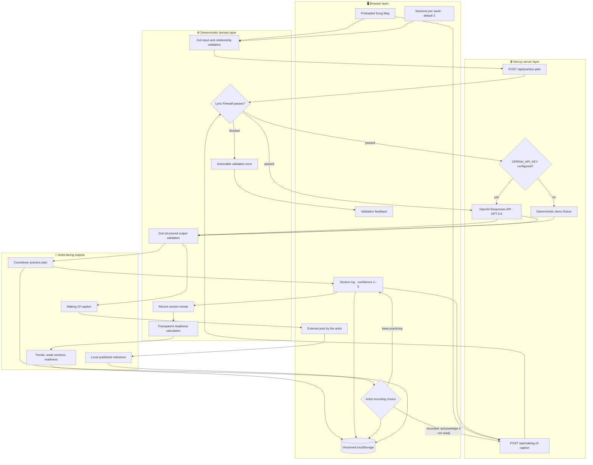
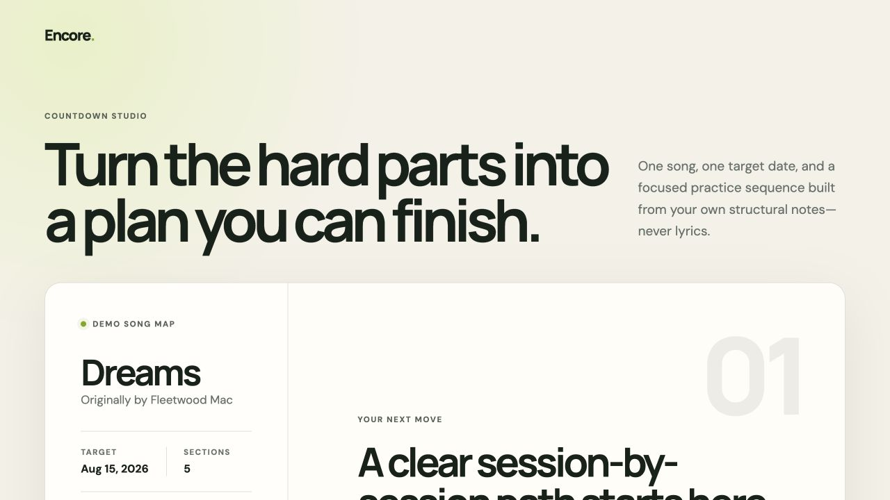
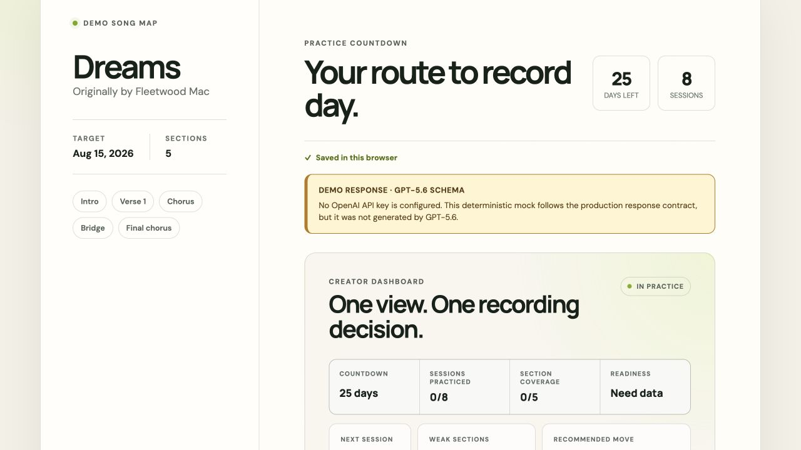
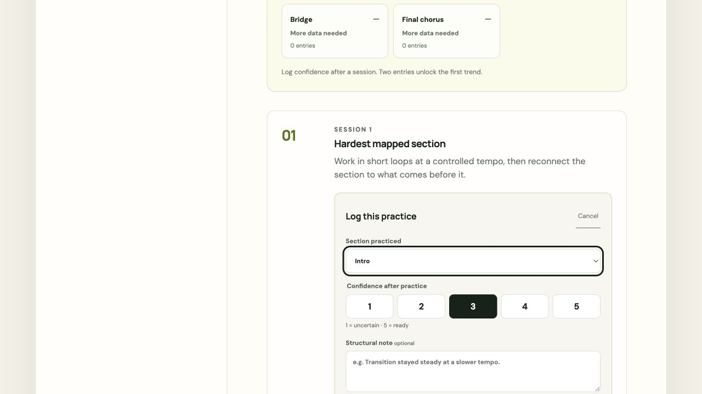
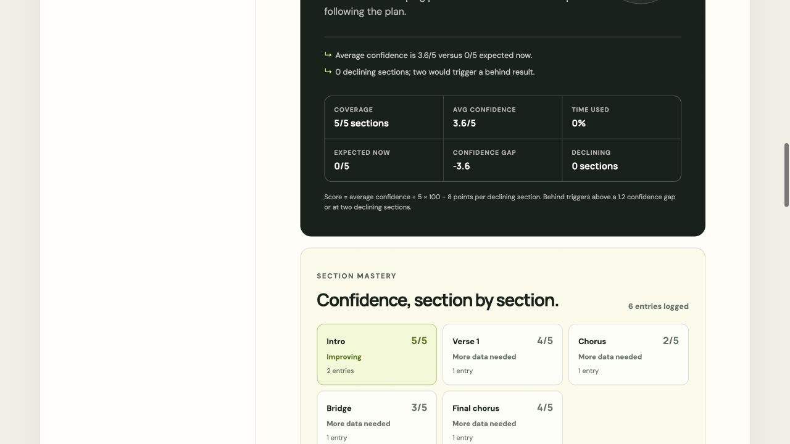
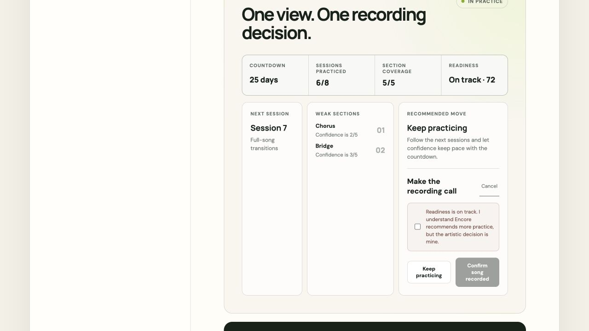
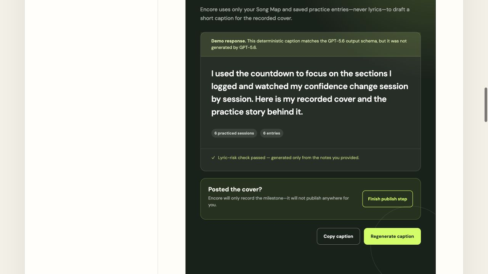

# Encore

**A one-song countdown studio that turns structural practice notes into a focused plan, an explainable recording decision, and a Making Of caption.**

[](./LICENSE)
[](https://www.typescriptlang.org/)
[](https://nextjs.org/)
[](https://platform.openai.com/docs/api-reference/responses)
[](./ENCORE_APPS_FOR_LIFE_PLAN.md)

Independent cover artists often manage one recording deadline across scattered notes, calendars, and memory. Encore connects that work into one path: a structured countdown plan, section-level practice logs, deterministic readiness, and a lyric-risk-checked caption. It was built by [Manoj Mallick](https://github.com/manojmallick) for OpenAI Build Week, with the implementation history, automated checks, and production smoke workflow kept in the public repository.

[Open the production demo](https://encore-sigma-ten.vercel.app) · [Read the Build Week submission](./docs/BUILD_WEEK_SUBMISSION.md)

## Table of Contents

- [Why Encore](#why-encore)
- [Honest Status](#honest-status)
- [Architecture](#architecture)
- [How it works](#how-it-works)
- [Product tour](#product-tour)
- [Built with Codex and GPT-5.6](#built-with-codex-and-gpt-56)
- [Judge test path](#judge-test-path-no-rebuild-required)
- [Quick Start](#quick-start)
- [Configuration](#configuration)
- [Project Structure](#project-structure)
- [Privacy and data handling](#privacy-and-data-handling)
- [Roadmap](#roadmap)
- [License](#license)

## Why Encore

Encore is designed for the gap between choosing a cover song and publishing the finished performance.

| The artist's problem | Encore's implemented response |
|---|---|
| Practice notes are disconnected from the recording date | A validated model boundary returns a session-by-session countdown plan, with a labeled fixture fallback for no-key testing |
| Progress feels subjective | Confidence is logged per section on a 1–5 scale and reduced to explicit trends |
| A single average can hide missing or declining sections | Readiness withholds incomplete scores and exposes every threshold and penalty |
| Free-text notes can accidentally become lyric storage | A transparent heuristic blocks long quotations, stanza-shaped text, and repeated substantive lines |
| The story behind the recording is lost | GPT-5.6 drafts a short caption from validated practice history after the song is marked recorded |
| “Published” is easy to overstate | Encore records an artist-confirmed local milestone; it does not post to an external platform |

## Honest Status

Encore is a deployed Build Week prototype with a complete demonstration path, not a general-purpose music platform.

| Area | Current reality |
|---|---|
| Song input | The UI uses one checked-in, read-only Song Map for “Dreams” by Fleetwood Mac. There is no Song Map editor or multi-song library. |
| Target date | The fixture target is `2026-08-15`. Live plan generation rejects it after that date because past targets fail closed. |
| AI features | With `OPENAI_API_KEY`, the two server routes call GPT-5.6. Without it, they return deterministic schema-compatible fixtures that the UI prominently labels as mock data. Automated browser tests also use deterministic responses. |
| Persistence | Plans, practice logs, recording decisions, and publication milestones use versioned `localStorage` keys. There is no account, database, or cross-device sync. |
| Readiness | The score is deterministic application logic, not an AI prediction or an assessment of vocal or instrumental audio. |
| Publishing | The artist posts externally, then confirms the milestone in Encore. No publishing-service integration exists. |
| Lyric safety | The Lyric Firewall is a risk-reduction heuristic. It is not a copyright determination or legal advice. |
| Measurement | No performance benchmark is claimed. Run the commands in [Quick Start](#verify-the-build) to measure the current test and build results on your machine. |

## Architecture



The model boundary is intentionally narrow. API routes validate unknown JSON, apply lyric-risk checks before outbound requests, request Zod-backed structured output, validate the response again, and return sanitized errors to the browser.

## How it works

1. **Load the demo Song Map.** The client renders the checked-in song metadata, five ordered sections, structural difficulty notes, and target date.
2. **Generate a countdown.** Choose 1–7 sessions per week. The plan route validates the request, rejects lyric-risky notes, calculates UTC calendar days, and caps the plan at 24 sessions. It requests contiguous structured sessions from GPT-5.6 when a key exists or uses a labeled deterministic fixture otherwise.
3. **Log practice.** Each entry records one known section, one plan session, confidence from 1–5, and an optional lyric-checked note of up to 280 characters.
4. **Calculate trends.** Fewer than two entries for a section yields `insufficient_data`. Otherwise, Encore compares the first and last confidence values among the three most recent entries to produce `improving`, `flat`, or `declining`.
5. **Calculate readiness.** No score is shown until every section has a confidence rating. The score starts from average confidence as a percentage and subtracts 8 points per declining section. Every factor and threshold is displayed.
6. **Make the recording call.** Encore recommends gathering data, adjusting the plan, continuing practice, or recording. The artist can record before `ready`, but must acknowledge the override.
7. **Generate the Making Of caption.** After recording and at least one valid practice entry, the caption route uses GPT-5.6 when configured or a labeled fixture otherwise. The returned caption must be 40–500 characters and pass the Lyric Firewall again.
8. **Confirm publication.** The artist copies and posts the caption outside Encore, then explicitly records the local publish milestone. The action is reversible without deleting practice history.

## Product tour

These screenshots follow the hosted no-key path. Plan and caption fixtures are
visibly labeled as mock data; readiness and trends are calculated from the
practice entries shown in the browser.

| Song Map | Countdown plan |
|---|---|
| [](./public/screenshots/01-song-map.png) | [](./public/screenshots/02-countdown-plan.png) |
| Start from one read-only, lyric-free map of the song's structure. | Generate a dated route to record day. The public deployment identifies its deterministic fixture. |

| Practice logging | Mastery and readiness |
|---|---|
| [](./public/screenshots/03-practice-logging.png) | [](./public/screenshots/04-mastery-readiness.png) |
| Record one mapped section, a confidence value from 1–5, and an optional structural note. | See section coverage and recent trends before relying on the recording recommendation. |

| Explainable recording decision | Lyric-safe Making Of caption |
|---|---|
| [](./public/screenshots/06-recording-decision.png) | [](./public/screenshots/07-making-of-publish.png) |
| Encore recommends the next move, exposes the score, and leaves the artistic decision to the creator. | Turn validated practice history into a caption, then publish externally and record the milestone locally. |

## Built with Codex and GPT-5.6

### How Codex was used

Codex carried Encore from an ordered product thesis to a tagged release. Each
increment became a scoped GitHub issue, an isolated branch, implementation,
tests, a reviewable pull request, and a merge. Codex also ran the browser golden
path, diagnosed validation and date failures, checked accessibility, refreshed
release documentation, and verified the production deployment.

The primary `/feedback` build session is
`019f74c9-756b-7421-a9e2-68d08be3bb63`. Its local Codex session metadata records
`gpt-5.6-sol` for the core implementation turns beginning with the Lyric
Firewall and structured planner and continuing through practice persistence,
recording readiness, caption generation, the golden path, hardening,
accessibility, deployment, documentation, and the `v1.0.0` release. The
[GPT-5.6 evidence record](./docs/GPT56_EVIDENCE.md) maps that session to the
public pull-request history.

### Important decisions made with Codex

| Decision | Why it mattered |
|---|---|
| Ship one complete song lifecycle | A coherent map-to-publish path was more testable than a shallow multi-song library. |
| Accept structural notes, never stored lyrics | The product can reason about difficult sections without becoming a lyric repository. |
| Keep readiness deterministic | Coverage, confidence, trend penalties, and thresholds remain visible and testable instead of becoming an unexplained model score. |
| Constrain model calls to two server boundaries | Zod schemas, preflight checks, output validation, and sanitized errors surround both generated artifacts. |
| Label the no-key path as mock data | Judges can complete the workflow without an API key while never mistaking fixtures for live GPT output. |

### Precise GPT-5.6 contribution

GPT-5.6 Sol in Codex contributed to the implementation and verification of the
core application from `v0.4.0` through `v1.0.0`. That work includes the Lyric
Firewall, GPT-5.6 response adapters, structured prompts and schemas, persistence,
mastery trends, explainable readiness, creator decisions, caption generation,
the record-to-publish flow, tests, accessibility, deployment, and release work.

This is separate from runtime generation. The server adapters target
`gpt-5.6`, but the public deployment has no `OPENAI_API_KEY`; it therefore uses
prominently labeled deterministic fixtures. Encore does not present those
fixtures as model output.

## Judge test path — no rebuild required

| Path | Steps | API key or credentials |
|---|---|---|
| Hosted product | Open the [production demo](https://encore-sigma-ten.vercel.app), generate the countdown, log practice, make a recording decision, generate the caption, and confirm publication. | None. Mock plan and caption responses are visibly labeled. |
| Local development | Clone the repository, run `pnpm install --frozen-lockfile` and `pnpm dev`, then open `http://localhost:3000`. A production build is not required. | None for the complete mock-data path. |
| Automated verification | Run `pnpm test` and `pnpm test:e2e`. Playwright starts its own local server and supplies deterministic API responses. | None. |

The checked-in Song Map is the sample data. No seed database, account, or test
login is required.

## Quick Start

### Prerequisites

- Git
- Node.js 24.x
- pnpm 10.33.2
- An OpenAI API key only for live plan and caption generation; the labeled mock flow works without one

### Run locally

```bash
git clone https://github.com/manojmallick/encore.git
cd encore
pnpm install --frozen-lockfile
cp .env.example .env.local
pnpm dev
```

Open <http://localhost:3000>.

Without an API key, plan and caption actions return highlighted deterministic fixtures shaped like the production GPT-5.6 responses. They are explicitly labeled as mock data. To call the live GPT-5.6 routes, edit `.env.local` and restart the development server:

```dotenv
NEXT_PUBLIC_SITE_URL=http://localhost:3000
OPENAI_API_KEY=replace-with-your-server-only-key
```

Never expose the key through a `NEXT_PUBLIC_*` variable or commit `.env.local`.

### Verify the build

```bash
pnpm lint
pnpm typecheck
pnpm test
pnpm exec playwright install chromium
pnpm test:e2e
pnpm build
```

`pnpm test:e2e` starts the local Next.js development server on `127.0.0.1:3100` and uses deterministic API responses. The production smoke suite requires an explicit HTTPS origin and does not start localhost:

```bash
ENCORE_SMOKE_BASE_URL=https://encore-sigma-ten.vercel.app pnpm test:smoke
```

See [docs/REPRODUCIBILITY.md](./docs/REPRODUCIBILITY.md) for clean-room setup, current measured test counts, and Vercel instructions.

## Configuration

| Variable or constant | Default | Purpose |
|---|---|---|
| `NEXT_PUBLIC_SITE_URL` | Runtime fallback: `https://example.com`; `.env.example`: `http://localhost:3000` | Canonical metadata origin. Set it to the final HTTPS origin in production. |
| `OPENAI_API_KEY` | None | Server-only credential for both GPT-5.6 routes. When absent or blank, both routes use visibly labeled deterministic demo fixtures. |
| `ENCORE_SMOKE_BASE_URL` | None | Required HTTPS origin for `pnpm test:smoke`; localhost, paths, queries, and fragments are rejected. |
| `VERCEL_AUTOMATION_BYPASS_SECRET` | None | Optional test-only header value for protected Vercel deployments. |
| `PRACTICE_PLAN_MODEL` / `MAKING_OF_CAPTION_MODEL` | `gpt-5.6` | Model used by the plan and caption adapters. |
| Plan/caption reasoning effort | `low` | Responses API reasoning setting for both model calls. |
| Caption text verbosity | `low` | Responses API text verbosity for caption generation. |
| `DEFAULT_SESSIONS_PER_WEEK` | `2` | Initial selection in the countdown UI. Valid request range is 1–7. |
| `MAX_PRACTICE_SESSIONS` | `24` | Maximum calculated or generated countdown length. |
| Song Map sections | 1–12 | Schema-enforced section count. Each section name is at most 80 characters and its structural note at most 500. |
| Practice confidence | 1–5 | Integer confidence recorded for one mapped section and plan session. |
| Practice note | Empty; maximum 280 characters | Optional structural observation checked for lyric risk before storage or model use. |
| Caption | 40–500 characters | Structured GPT output range before the returned caption is lyric-checked. |
| Recent trend window | Latest 3 entries | Window used after a section has at least two entries. |
| Readiness penalties | 8 points per declining section | Applied after average confidence is converted to a percentage. |
| Behind thresholds | Confidence gap greater than 1.2, or at least 2 declining sections | Either condition produces `behind`. |
| Ready thresholds | Average confidence at least 4/5, 0 declining sections, and at most 2 days remaining | All conditions are required for `ready`. |
| Browser storage versions | `1` | Separate versioned records for plans, logs, recording decisions, and publication milestones. |
| Maximum saved practice logs | `500` | Schema limit for one Song Map's local practice-log record. |

## Project Structure

```text
encore/
├── app/
│   ├── page.tsx                         # Next.js entry point
│   ├── countdown-workspace.tsx          # Client orchestration and local persistence
│   ├── creator-dashboard.tsx            # Recommendation and recording decision UI
│   ├── making-of-caption.tsx            # Caption, copy, and publish-confirmation UI
│   └── api/
│       ├── practice-plan/route.ts       # Validated countdown API boundary
│       └── making-of-caption/route.ts   # Validated caption API boundary
├── src/
│   ├── logic/
│   │   ├── fixtures/demo-song-map.ts    # The read-only demonstration song
│   │   ├── practice-plan.ts             # Plan schemas, calendar facts, prompts, validation
│   │   ├── lyric-risk.ts                # Explainable text-risk heuristic
│   │   ├── section-mastery.ts           # Practice-entry validation and trends
│   │   ├── recording-readiness.ts       # Deterministic readiness calculation
│   │   ├── creator-dashboard.ts         # Weak-section ranking and recommendation
│   │   └── *-storage.ts                 # Versioned localStorage adapters
│   └── server/
│       ├── model-runtime.ts             # Live-key selection and labeled demo fixtures
│       ├── openai-practice-plan.ts      # Responses API plan adapter
│       └── openai-making-of-caption.ts  # Responses API caption adapter
├── tests/
│   ├── e2e/golden-path-flow.ts          # Reusable deterministic browser flow
│   └── smoke/production.spec.ts         # HTTPS deployment contract
├── public/screenshots/                   # Hosted product-tour and Devpost images
├── docs/                                # Architecture, reproduction, diary, submission
├── playwright.config.ts                 # Local Chromium configuration
├── playwright.smoke.config.ts           # Existing-deployment smoke configuration
├── vercel.ts                            # Install, build, cache, and security headers
└── package.json                         # Pinned package manager and task scripts
```

## Privacy and data handling

- Song metadata, structural notes, practice history, and decisions remain in the current browser's `localStorage` unless a live AI feature is requested.
- Live plan requests send song metadata and structural notes to the OpenAI Responses API. For captions, the browser sends the Song Map, practice logs, and recording decision to Encore's server; the model prompt contains song metadata and derived practice history after the decision is validated.
- `OPENAI_API_KEY` is read only by server modules. It is never required by browser code.
- Encore does not collect audio, retrieve lyrics, create accounts, or write to a project database.
- Browser storage is origin-scoped but not an encrypted vault. Anyone with access to the same browser profile may be able to inspect it.
- Malformed or mismatched persisted records are ignored and removed when storage access permits.
- The Lyric Firewall reduces the chance of sending lyric-like text. It cannot determine copyright status or provide legal advice.

## Roadmap

Only the v1.0 submission freeze is currently tracked. The other items below come from the project's documented post-prototype exclusions and have no promised date.

| Item | Status | Evidence or boundary |
|---|---|---|
| Complete the Build Week submission | Tracked in [issue #33](https://github.com/manojmallick/encore/issues/33) | `v1.0.0` and Codex session evidence are complete; the public video and final Devpost submission remain |
| Editable and multiple Song Maps | Candidate | The current UI imports one fixed fixture |
| Accounts and cross-device persistence | Candidate | Current persistence is browser-local only |
| Audio recording, pitch analysis, or transcription | Research only | Explicitly excluded from the Build Week release |
| Direct publishing integrations | Candidate | Current publishing is an artist-confirmed local milestone |

## License

Encore is available under the [MIT License](./LICENSE). Copyright © 2026 Manoj Mallick.
