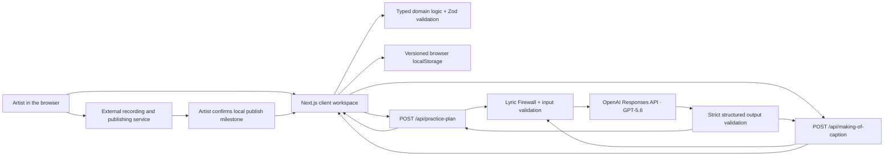

# Encore architecture

Encore is a Next.js 16 application with one deliberately bounded workflow:
Song Map → countdown plan → practice history → readiness → recording decision
→ Making Of caption → artist-confirmed publication.

## System map

Encore does not store API keys in the browser and does not publish to an
external platform. The artist remains responsible for recording and posting;
Encore stores only their local milestone and the exact generated caption.

## Runtime layers

| Layer | Responsibilities | Primary files |
|---|---|---|
| Next.js UI | Orchestrates the golden path, accessible interactions, loading/error states, and dashboard | `app/countdown-workspace.tsx`, `app/creator-dashboard.tsx`, `app/making-of-caption.tsx` |
| Client adapters | Validate browser requests/responses and sanitize non-actionable server failures | `src/logic/practice-plan-client.ts`, `src/logic/making-of-caption-client.ts` |
| Domain logic | Song schemas, countdown construction, practice logs, trends, readiness, recording, publication, lyric checks | `src/logic/**` |
| Route handlers | Parse unknown JSON, map typed failures to HTTP status codes, inject model adapters | `app/api/practice-plan/route.ts`, `app/api/making-of-caption/route.ts` |
| OpenAI adapters | Build GPT-5.6 Responses API requests with low reasoning and Zod-backed structured output | `src/server/openai-practice-plan.ts`, `src/server/openai-making-of-caption.ts` |
| Browser persistence | Validate, version, restore, and discard Song Map-specific local state | `src/logic/*-storage.ts`, `src/logic/recording-decision.ts`, `src/logic/song-publication.ts` |

## Data and trust boundaries

All external data is untrusted. Zod schemas validate browser input at the
client boundary, again in route handlers, and after model output. Relationship
checks ensure logs refer to known sections and sessions; persistence restores
only records matching the active Song Map. Unknown fields and malformed dates,
confidence values, provider output, and saved JSON fail closed.

The API key is read only by modules under `src/server/`. Browser code calls the
two same-origin API routes and receives validated product objects, never raw
provider responses. Configuration, provider, refusal, and malformed-output
details are converted to stable public errors so secrets and internals do not
reach the browser.

## GPT-5.6 boundaries

The plan route sends the validated Song Map and practice frequency to
`gpt-5.6`, with low reasoning, and requires a `practice_plan` structured output.
The domain layer caps the result at 24 sessions and verifies dates, section
references, session order, and coverage before returning it.

The caption route is unlocked only after a valid recorded decision and practice
history. It sends structured artist notes, confidence history, trends, and
optional practice observations to `gpt-5.6`, with low reasoning and low text
verbosity, and requires a `making_of_caption` structured output.

The Lyric Firewall runs before both outbound requests. Caption output is also
checked on return. Its three transparent heuristics flag long quoted passages,
stanza-like multiline input, and repeated substantive lines. This reduces risk;
it is not a copyright determination or legal advice.

## Deterministic readiness

Recording readiness does not call a model. It is derived on every render from
validated countdown and practice-log data:

- no score exists until every mapped section has a confidence rating;
- the base score is average confidence expressed as a percentage;
- each declining section subtracts eight points;
- `behind` takes precedence when the confidence gap is greater than 1.2 points
  or at least two sections are declining;
- `ready` requires at least 4/5 average confidence, no decline, and no more than
  two days remaining.

The UI displays the inputs, threshold reasons, and result instead of hiding the
decision behind an opaque score.

## Persistence model

State is stored per Song Map under versioned local keys:

| State | Key shape |
|---|---|
| Countdown plan | `encore:practice-plan:v1:<song-map-id>` |
| Practice logs | `encore:practice-logs:v1:<song-map-id>` |
| Recording decision | `encore:recording-decision:v1:<song-map-id>` |
| Publication milestone | `encore:song-publication:v1:<song-map-id>` |

Invalid or stale records are ignored and, when possible, removed. Storage
failure degrades to in-memory state for the current visit. Cross-device sync,
accounts, databases, audio analysis, and external publishing integrations are
outside the Build Week scope.

## Verification boundaries

Vitest injects model functions and clocks at domain/route seams. Playwright
intercepts both API routes to exercise the complete browser lifecycle without a
key or network charge. The production Playwright configuration reuses that flow
against an explicit HTTPS origin without starting a local server, then verifies
canonical metadata, Vercel response headers, and immutable Next.js asset
caching. An optional automation-bypass secret is read only from the runner
environment. See [Reproduce Encore](./REPRODUCIBILITY.md) for exact commands and
recorded counts.
